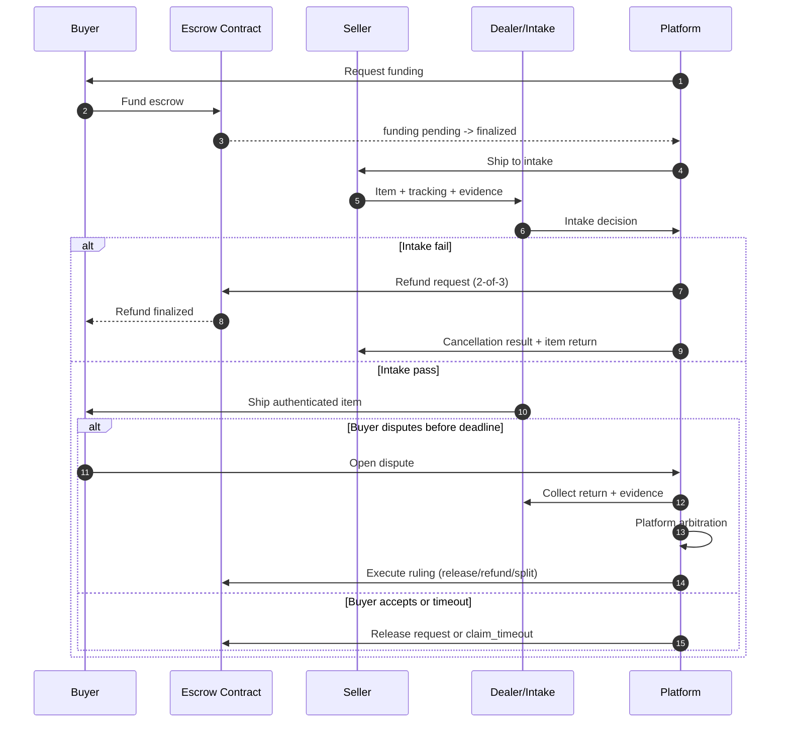

# Escrow Plan (Stablecoin-Only v2 Target Operating Model)

Last updated: 2026-03-30

This is the target escrow model for modern ecommerce while remaining strictly stablecoin-mediated.

## 1) Scope and non-goals
- Settlement is stablecoin-only.
- Escrow is transaction-specific and tied to an underlying order.
- Funds are held in escrow lock after finalized funding until a valid settlement path executes.
- Platform arbitration applies only to escrow disputes.
- Credit-card rails and card-network dispute/chargeback workflows are out of scope.
- Open-loop wallet balances and unrelated third-party transfers are out of scope.

## 2) Core escrow design
- Smart-contract escrow with `2-of-3` signatures for settlement actions.
- Signers are buyer, seller, and platform signer (or delegated dealer signer).
- Funding finality moves escrow into a hold state: `funded_locked`.
- Settlement outcomes are release, refund, or policy-bounded split.
- Timeout-claim path (`claim_timeout`) exists when buyer does not dispute before deadline.
- Split settlement capability exists at contract level; policy can keep it disabled.
- Escrow isolation is per transaction (`escrow_id` per order), implemented inside a shared vault contract.

### 2.1 Escrow account topology decision
Decision:
- Use transaction-level escrow accounts (one escrow namespace per order/transaction).
- Do not use global pooled buyer-seller escrow accounts.
- Do not use shared buyer-seller pair escrow accounts.

Implementation shape:
- Deploy one `EscrowVault` contract (or a small versioned set), not one contract per transaction.
- Store each transaction as a namespaced record keyed by `escrow_id`.
- Keep execution paths (`release`, `refund`, `split`, `claim_timeout`) strictly scoped to that `escrow_id`.

Rationale:
- Preserves strict liability and dispute isolation per transaction.
- Avoids cross-order contamination between the same buyer and seller.
- Delivers most of the gas benefit of pooling while keeping architecture clean.

## 3) Role model
- Buyer funds escrow, accepts item, or opens dispute within deadline.
- Seller ships to intake and provides shipping evidence.
- Platform/dealer performs intake and authenticity/condition verification.
- Platform arbitration team decides disputed outcomes and triggers onchain execution.

Dealer definition:
- Dealers are approved inspection partners.
- Dealer signing is delegated, scoped, time-bounded, auditable, and revocable.

## 4) Canonical lifecycle
1. Order is created; a transaction-scoped escrow record (`escrow_id`) is created in the vault and terms are fixed.
2. Buyer funds escrow.
3. Funding reaches finality and escrow enters hold (`funded_locked`).
4. Seller ships item to platform/dealer intake.
5. Intake result:
- pass: item ships to buyer.
- fail: refund path begins and order is cancelled.
6. Buyer outcome after delivery:
- accept: release path begins.
- dispute before deadline: return/evidence/arbitration flow begins.
- no dispute until deadline: `claim_timeout` can finalize release path.
7. Dispute outcome:
- ruled release.
- ruled refund.
- ruled split (if policy allows).
8. Onchain settlement finalizes and escrow closes.

### 4.1 Escrow flow diagram

## 5) V2 state model (orthogonal)
Single-state modeling is replaced by three explicit dimensions.

### 5.1 `commerce_state`
- `created`
- `awaiting_funding`
- `funded_locked` (the stablecoin hold state)
- `seller_shipped_to_intake`
- `intake_passed`
- `buyer_delivered`
- `completed`
- `cancelled`

### 5.2 `onchain_state`
- `none`
- `funding_pending_finality`
- `funded_finalized`
- `release_pending_finality`
- `refund_pending_finality`
- `split_pending_finality`
- `released_finalized`
- `refunded_finalized`
- `split_finalized`

### 5.3 `dispute_state`
- `none`
- `opened`
- `return_required`
- `evidence_collection`
- `arbitration_in_progress`
- `ruled_release`
- `ruled_refund`
- `ruled_split`
- `closed`

### 5.4 Key invariants
- `funded_locked` requires `onchain_state = funded_finalized`.
- Any terminal commerce state requires a terminal onchain state:
- `completed` requires `released_finalized` or `split_finalized`.
- `cancelled` requires `refunded_finalized` or no funding (`onchain_state = none`).
- `dispute_state != none` is allowed only after `buyer_delivered` and before dispute deadline.
- Exactly one final onchain outcome is allowed per escrow.

## 6) Cancellation model
Cancellation is explicit and no longer conflated with generic refund semantics.

### 6.1 Cancellation modes
- `pre_funding_abort`: no finalized funding ever occurred.
- `post_funding_refund`: funding finalized, then fully refunded.

### 6.2 Cancellation reasons (minimum set)
- `buyer_no_funding`
- `seller_sla_missed`
- `intake_failed`
- `policy_risk_abort`
- `arbitration_refund_ruling`
- `admin_manual_cancel`

### 6.3 Cancellation rules
- `pre_funding_abort` can only happen before `funded_finalized`.
- `post_funding_refund` must pass through `refund_pending_finality -> refunded_finalized`.
- Once cancelled, release/split paths are forbidden.

## 7) Arbitration model (platform-only)
Arbitration exists only for platform escrow disputes.

### 7.1 Arbitration lifecycle
1. Dispute opens with structured reason codes and required initial evidence.
2. Return authorization and custody checkpoints are enforced when applicable.
3. Evidence collection window runs with explicit deadlines.
4. Platform arbitration enters `arbitration_in_progress`.
5. Ruling is one of `ruled_release`, `ruled_refund`, `ruled_split`.
6. Ruling is executed onchain and dispute closes.

### 7.2 Arbitration data requirements
- `arbitration_case_id`
- `assigned_arbitrator_id`
- `opened_at`, `evidence_deadline_at`, `ruled_at`, `closed_at`
- `ruling_reason_code`
- `evidence_bundle_hash` (offchain dossier anchor)
- `enforcement_tx_hash` and finality result

## 8) Contract and settlement semantics
- `2-of-3` signatures required for release, refund, and split execution.
- `claim_timeout` is permissionless after deadline if no valid in-window dispute exists.
- Split outputs must satisfy conservation: `sum(outputs) == escrow_amount`.
- Allowed recipients are bounded to buyer, seller, and fixed fee recipients.
- Fee caps are immutable per escrow (`max_total_fee_bps`).
- Delegated dealer signatures are valid only when delegation is active and within scope.

### 8.1 Vault architecture and gas strategy
- Contract topology is singleton vault plus transaction namespaces, not per-transaction contract deployment.
- Every critical method accepts/derives `escrow_id` and mutates only that escrow record.
- Onchain storage is append-safe and one-way for terminal execution per `escrow_id`.
- Gas optimization focus is calldata/signature efficiency and batch-safe operations, not account co-mingling.

## 9) API and workflow evolution (breaking)
The escrow API should move to explicit command endpoints with idempotency keys.

### 9.1 Command examples
- `POST /v1/escrow` (create transaction-scoped escrow record)
- `POST /v1/escrow/{escrow_id}/funding/submit`
- `POST /v1/escrow/{escrow_id}/funding/finalize`
- `POST /v1/escrow/{escrow_id}/shipment/to-intake`
- `POST /v1/escrow/{escrow_id}/intake/record`
- `POST /v1/escrow/{escrow_id}/delivery/record`
- `POST /v1/escrow/{escrow_id}/disputes/open`
- `POST /v1/escrow/{escrow_id}/disputes/evidence`
- `POST /v1/escrow/{escrow_id}/disputes/arbitration/start`
- `POST /v1/escrow/{escrow_id}/disputes/rule`
- `POST /v1/escrow/{escrow_id}/settlement/claim-timeout`
- `POST /v1/escrow/{escrow_id}/cancel`

### 9.2 API requirements
- Each command validates legal state transitions across all three state dimensions.
- Every mutation is idempotent with deterministic replay behavior.
- Every accepted transition writes an append-only event with actor, reason, and evidence references.

## 10) Data model evolution (breaking)
- Replace legacy `escrow_state` with `commerce_state`, `onchain_state`, and `dispute_state`.
- Keep `escrow_id` as a mandatory transaction-level identifier (1:1 with order unless policy explicitly supports multi-shipment splits).
- Add explicit cancellation fields: `cancellation_mode`, `cancellation_reason_code`, `cancelled_at`.
- Add arbitration fields or dedicated tables:
- `escrow_arbitration_cases`
- `escrow_evidence`
- Keep stablecoin settlement fields (`settlement_network`, `token_symbol`, tx hashes, finality timestamps).
- Add vault identity fields for upgrade safety (`vault_contract_address`, `vault_version`, optional `vault_namespace`).
- Remove multi-rail ambiguity from escrow (no card/fiat execution paths).

## 11) Legacy cleanup policy
No legacy dual-path execution.

1. Migrate records to v2 states.
2. Cut all reads/writes to v2 fields.
3. Remove legacy enums, transition guards, and API shapes in the same refactor window.

## 12) Migration mapping from legacy state
Use this one-time mapping only during migration.

- `initiated` -> `created / none / none`
- `funding_pending_finality` -> `awaiting_funding / funding_pending_finality / none`
- `funded` -> `funded_locked / funded_finalized / none`
- `seller_shipped` -> `seller_shipped_to_intake / funded_finalized / none`
- `buyer_received` -> `buyer_delivered / funded_finalized / none`
- `inspection_window_open` -> `buyer_delivered / funded_finalized / none`
- `disputed` -> `buyer_delivered / funded_finalized / opened`
- `release_pending_finality` -> `buyer_delivered / release_pending_finality / (none|ruled_release)`
- `refund_pending_finality` -> `cancelled / refund_pending_finality / (none|ruled_refund)`
- `released` -> `completed / released_finalized / closed`
- `cancelled` -> `cancelled / refunded_finalized|none / closed|none`

After migration completes, legacy state symbols are removed from code and schema.

---

## 1) Scope
This note summarizes U.S. federal precedent relevant to Watchbook's escrow model.
It is product-planning guidance and not legal advice.

- focus: FinCEN administrative rulings on escrow/transaction-management flows
- jurisdiction: U.S. federal money-transmitter analysis under the BSA
- important limit: state money-transmitter licensing (`MTL`) is separate and still required analysis

## 2) Core legal hook
FinCEN's money-transmitter definition is fact-specific and includes a limitation for funds movement that is only integral to a non-money-transmission service.

- rule framework: `31 CFR 1010.100(ff)(5)`
- key limitation: `31 CFR 1010.100(ff)(5)(ii)(F)` (funds accepted/transmitted only integral to sale of goods or provision of services)

## 3) Supporting cases

### `FIN-2014-R004` (April 29, 2014) - favorable
- question: whether internet sale escrow service is a money transmitter
- outcome: **not** a money transmitter (under presented facts)
- facts FinCEN emphasized:
  - buyer/seller define transaction terms upfront
  - provider holds funds in segregated account structure
  - release/refund tied to pre-agreed conditions (delivery/inspection/return logic)
  - money movement is integral to escrow management, not a separate payments product

### `FIN-2014-R005` (April 29, 2014) - favorable
- question: whether secured-transaction management service is a money transmitter
- outcome: **not** a money transmitter (under presented facts)
- facts FinCEN emphasized:
  - platform managed specific buyer/seller transactions with defined terms
  - provider handled dispute/verification/document workflow as transaction management
  - payments were not offered as generic third-party transfers
  - acceptance/transmission was necessary and integral to the managed transaction service

### `FIN-2014-R006` (April 29, 2014) - cautionary contrast
- question: classification of online real-time deposit/settlement/payment platform
- outcome: money transmitter
- facts that differed from `R004`/`R005`:
  - user account/balance model (buyers and sellers could maintain/withdraw funds)
  - platform supported broader transfer/payment behavior beyond strict escrow arbitration
  - not represented as traditional escrow with independent conditional adjudication

## 4) Practical pattern for Watchbook
To align with favorable `R004`/`R005` precedent, design escrow as transaction management, not as a general wallet/payment rail:

1. Limit funds handling to specific buyer-seller transactions with clear contract terms.
2. Tie release/refund strictly to predefined milestones and dispute outcomes.
3. Avoid open-loop stored-balance behavior (general keep/withdraw/use-anytime accounts).
4. Do not enable unrelated third-party payouts.
5. Keep escrow records/audit trail showing objective condition checks and outcomes.
6. Ensure TOS/UX describes escrow transaction management, not generic transfer services.

## 5) What this does and does not prove
- Strong support: some escrow models are outside federal money-transmitter status.
- Not proven: all "escrow-labeled" models are exempt.
- Not covered by these rulings: state-by-state `MTL` obligations, which require separate analysis.

## 6) Consolidated References (verified and qualified as of 2026-03-30)
All links below were re-checked and resolved with HTTP `200` on 2026-03-30.

### U.S. primary authority (highest weight)
- FinCEN `FIN-2014-R004` (escrow service ruling): https://www.fincen.gov/resources/statutes-regulations/administrative-rulings/application-money-services-business-1
- FinCEN `FIN-2014-R005` (secured transaction service ruling): https://www.fincen.gov/resources/statutes-regulations/administrative-rulings/whether-company-offers-secured-transaction
- FinCEN `FIN-2014-R006` (online real-time payment platform ruling): https://www.fincen.gov/resources/statutes-regulations/administrative-rulings/whether-company-provides-online-real-time
- FinCEN MSB registration resource (definitions and federal framing): https://www.fincen.gov/resources/money-services-business-msb-registration
- `31 CFR 1010.100` official federal publication: https://www.govinfo.gov/app/details/CFR-2025-title31-vol3/CFR-2025-title31-vol3-sec1010-100
- NY DFS money transmitter licensing overview (state regulator): https://www.dfs.ny.gov/apps_and_licensing/money_transmitters
- Texas DOB MSB FAQ (state regulator guidance): https://www.dob.texas.gov/money-services-businesses/faqs

### Japan primary authority (highest weight)
- Japan courts integrated search (used with query terms listed in section 7): https://www.courts.go.jp/hanrei/search1/index.html
- Supreme Court case detail (`平成12(あ)873`): https://www.courts.go.jp/hanrei/50024/detail2/index.html
- PSA text (e-Gov, Act No. 59 of 2009): https://laws.e-gov.go.jp/law/421AC0000000059
- Cabinet Office Ordinance (`資金移動業者に関する内閣府令`, Art. 1-2): https://laws.e-gov.go.jp/law/422M60000002004
- FSA WG report (Dec 20, 2019): https://www.fsa.go.jp/singi/singi_kinyu/tosin/20191220/houkoku.pdf
- FSA Payments WG minutes (Nov 7, 2024): https://www.fsa.go.jp/singi/kessaiseido_wg/gijiroku/20241107.html
- FSA notice / public comment result (Dec 16, 2025): https://www.fsa.go.jp/news/r7/sonota/20251216/20251216.html

### Secondary source (context aid only; do not treat as binding authority)
- CSBS agent-of-payee map (industry/policy compilation): https://www.csbs.org/agent-payee-exemption-map

## 7) Japan-specific source scan (preliminary, as of Feb 14, 2026)
Goal: find Japanese authority supporting a position that some escrow structures may not require `資金決済法` licensing.

What was searched and what was found:

1. Japan courts DB (`裁判例検索`) query: `資金決済に関する法律` + `エスクロー`
   - result: no matching published decision in this query.
2. Japan courts DB query: `資金決済に関する法律` + `収納代行`
   - result: one hit, but it was an IP/copyright case and not useful for PSA licensing analysis.
3. Japan courts DB query: `資金決済法違反`
   - result: no matching published decision in this query.
4. Japan courts DB query: `資金決済に関する法律違反`
   - result: one hit, but it was a crime-proceeds case and not a ruling on escrow licensing scope under PSA.
5. Japan courts DB query: `平成12(あ)873`
   - result: found Supreme Court decision (Mar 12, 2001) defining `銀行法2条2項2号` "為替取引を行うこと" broadly.
   - implication: useful as a baseline for what counts as remittance-like activity, but not a direct escrow safe-harbor case.

Net result:
- no direct published Japanese case was found that expressly states "escrow does not require PSA licensing."
- most support for a non-licensing path appears to come from statute/regulatory design and interpretation (not case law), especially PSA structure (including deeming provisions and ordinance conditions) and FSA materials.

Important limits:
- this search used publicly available court decisions and regulator materials.
- the court site itself notes that not all decisions are published.

## 8) Japan Legal Reading for Escrow (What Supports vs. What Does Not)
This section elaborates the two key statements and maps them to source text.

### A) What PSA Article 2-2 is doing (and not doing)
Current PSA Article 2-2 (`資金決済法 第二条の二`) states that certain collection/receipt models are "deemed" to be `為替取引` when conditions are met.

- important point: this is a deeming-inclusion rule, not a blanket exclusion rule.
- practical consequence: failing Article 2-2 conditions does not automatically prove a model is outside remittance regulation.
- legal argument for non-licensing must be built from full structure and risk profile, not from Article 2-2 alone.

### B) Where the condition logic comes from
The detailed conditions are in `資金移動業者に関する内閣府令` Article 1-2.

- Article 1-2 requires recipient to be an individual (non-business use) plus one of listed conditions.
- Some subitems are drafted as negative tests (`〜でないこと`), including:
  - debt-discharge/counter-performance timing pattern
  - contract-formation involvement pattern
- interpretation signal: certain escrow-like or transaction-involvement models are carved out of the Article 2-2 deeming bucket.
- limit: this still is not a universal safe harbor from all `為替取引` analysis.

### C) FSA policy materials on when remittance regulation need is lower
The 2019 FSA WG report and later 2024 WG discussion provide the strongest support language for a non-license argument in narrow scenarios.

- 2019 report (`2019-12-20`) says, for collection agency models where:
  - creditor is a business entity or public body, and
  - contract clearly provides debtor's obligation is discharged at payment to collector (no double-payment risk),
  then need to apply remittance regulation is "not necessarily high."
- Same report's escrow subsection says immediate new regulation was not agreed as necessary at that time and kept as continued-study topic.
- The report also states a minimum condition in this area: debtor discharge/no double-payment risk should be contractually clear.
- 2024 WG minutes (`2024-11-07`) restate the same two-factor rationale, but also note this was not an a priori denial of `為替取引` applicability; it was a risk-based regulatory-necessity judgment.

### D) How to build evidence for "escrow may not require PSA licensing"
Given no direct published Japanese case found, the strongest support package is documentary and structure-based:

1. Contract language proving debtor discharge at payment to escrow/collector.
2. Agency/receipt authority chain proving valid delegated collection.
3. Product flow proving strict tie to underlying cause transaction (sale/service), not standalone transfer.
4. No wallet/open-loop behavior (no general stored balance, no unrelated payouts, no peer transfer rail).
5. Controlled release/refund logic tied to objective milestones/disputes.
6. Funds protection model (segregation/trust timing, short holding period, operational controls).
7. User disclosures explaining role as transaction assurance/escrow, not generic remittance service.

### E) Litigation/precedent status
- no direct published Japanese case was found that expressly grants an escrow safe harbor from PSA licensing.
- therefore, support comes mainly from:
  - statute + ordinance structure, and
  - FSA WG/policy materials.
- this means legal risk remains fact-sensitive and should be validated with Japan counsel and, where feasible, regulator consultation.

## 9) Yen Stablecoin Off-Ramp Notes (as of 2026-03-31)
This section summarizes current off-ramp availability for `JPYC` and `JPYSC` for escrow settlement design.

### A) JPYC (regulated electronic payment instrument) status
- Off-ramp support appears live via `JPYC EX` (issuer platform) with issuance/redemption flow.
- Published flow indicates redemption by sending `JPYC` to a designated address and receiving JPY payout to a registered bank account.
- Identity verification is required (including JPKI / My Number card in published materials).
- Important distinction: this is separate from `JPYC Prepaid`; new issuance of JPYC Prepaid has ended.

### B) JPYSC status
- `JPYSC` has been publicly announced by Startale Group + SBI Holdings with planned launch in `Q2 2026`.
- Public materials state launch is subject to completion of required regulatory approvals.
- `SBI VC Trade` is named as primary distribution partner.
- As of this date, no public live retail redemption/off-ramp procedure has been confirmed in the referenced materials.

### C) Escrow routing implications
- `JPYC`: usable as a candidate JPY stablecoin rail where issuer redemption onboarding and bank payout requirements are operationally acceptable.
- `JPYSC`: treat as pending rail until live redemption/off-ramp docs and operations are publicly available.
- For production bilateral flows today, keep a fallback path through exchange + bank settlement rails when direct yen stablecoin off-ramp coverage is unavailable.

### D) Sources
- JPYC EX launch (issuance/redemption): https://prtimes.jp/main/html/rd/p/000000283.000054018.html
- JPYC registration / issuance-redemption framing: https://prtimes.jp/main/html/rd/p/000000274.000054018.html
- JPYC EX redemption wording restated in partner announcement: https://prtimes.jp/main/html/rd/p/000000071.000061051.html
- JPYC Prepaid issuance-end notice: https://blog.jpyc.jp/58ddc689e89049d3a85797233c173566
- JPYSC announcement and timeline: https://www.sbigroup.co.jp/english/news/pdf/2026/0227_c_en.pdf
- JPYSC launch target and approval condition: https://startale.com/blog/jpysc
